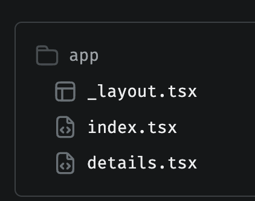
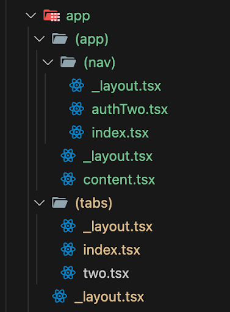

# Expo Router

Expo router is a multi-platform routing framework for react native and web applications. Is important to mention that It uses a **FILE-BASED** method to determine routes inside your app.

The basic structure would be as follows:

 

### Installation

Expo router is included when creating a default expo project using the following command:

`npx create-expo-app AppName`

### How do \_layout files work?

In the root `_layout`, it is recommended to insert the necessary providers, such as authentication, state management tools, context, themes, etc. In Expo Router, each subfolder created generates what are called 'Route Groups', which can contain their own layout. The layout acts as a sort of middleware for the routes (files) within that folder, allowing us to configure the stacks, tabs, and routes we want to have within each layout. Additionally, any extra logic needed for that subgroup of routes can be added.

It is important to remember that routes must have a unique name globally. Their names must match the existing file for that route, and stack options can be customized by declaring the stack in the respective layout file. It is also important to note that if a folder does not contain a layout, Expo Router automatically generates the stack based on the existing files and their names.
As a reminder, you can use `useRootNavigationState` from expo-router to debug the navigation state.

### Authentication

For authentication, remember that with Expo Router, all routes are always defined and accessible. You should use runtime logic to redirect users away from specific screens depending on whether they are authenticated.

For example, a basic authentication setup within the app folder:

Create a folder (app) inside the app folder, which will contain a layout file with the stack for authenticated routes and the logic to detect authentication, generally coming from the state declared in the root layout. It can also contain its own bottom tab, which should be created in an internal folder following the same pattern.

In this way, you could create an app that has, for example, a public bottom tab and an authenticated bottom tab.

It would look something like this:

 
 

**./(app)/\_layout** - stack of authenticated routes (includes validation logic and allows for declaring additional routes)
**./(app)/(nav)** - authenticated bottom tab (following the same tab pattern)
**./(tabs)** - public bottom tab
**./\_layout.tsx** - root layout

 

Expo Router redirects to the index file of the folder or subfolder it finds. If an index file is not found, it generally may not locate a valid initial route. If there are multiple folders containing an index file, Expo Router will follow the alphabetical order of these folders rather than the order in which routes are defined in the stack.

### Tips

Screen con bottom tab sin tab button:
To have a route available within a tab stack without displaying the tab button, you can create the file for that route, then define the tab screen in the layout, and in the options for that tab screen, set href:null. The route will exist in the tab stack and will continue to display the bottom tab bar when represented, but without having its own button.

### Sources

https://docs.expo.dev/router/
https://docs.expo.dev/router/advanced/root-layout/
https://docs.expo.dev/router/advanced/tabs/
https://docs.expo.dev/router/advanced/stack/

 
 

##### Disclaimer

<small>Keep in mind that this guideline will keep getting updated with new information and is not a full detailed manual of all Expo Router functionalities. Instead, it is a guide to understanding the basic operation and structure of both the automatic part and what matters when using the Expo Router. For more precise details about a specific functionality, please refer to the documentation. If you find any incorrect information, please contact the development team.</small>
