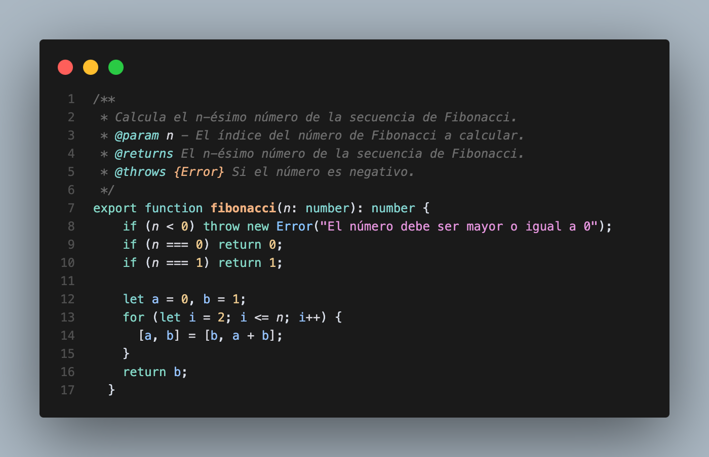
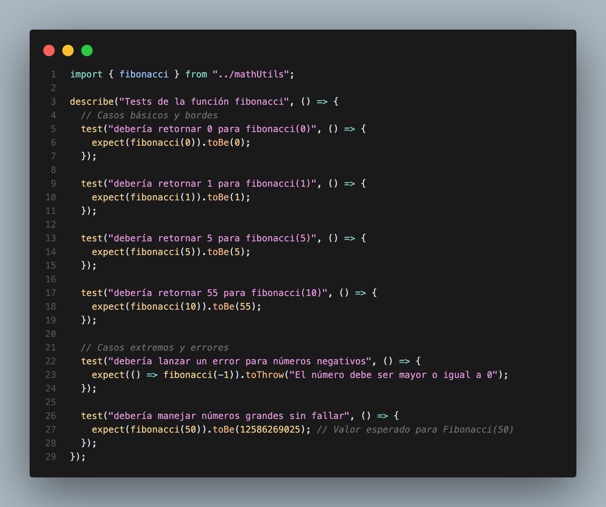
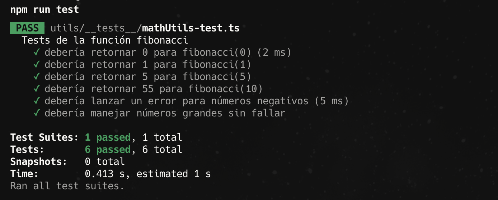

# Unit Testing
While mobile apps typically act as clients with most business logic residing in the backend, and despite using static code analysis methods like TypeScript type checking and linting tools to catch common errors, there are cases where we have complex client-side functions that need testing. For example, mathematical calculations required for displaying information on screen. This is where unit testing becomes valuable.

## What is a Unit Test?
A unit test is a test that covers the smallest parts of code, like individual functions and methods. It verifies that given specific input values, the tested code behaves as expected and produces the correct output.

## Unit Testing with Jest
For unit testing, we'll use Jest (see [documentation here](https://jestjs.io)), a battle-tested JavaScript testing framework. Jest is designed for simplicity, speed, and reliability. While it's widely used for testing React and React Native applications, it also works well with vanilla JavaScript, Node.js, and other JavaScript frameworks.

## Setup
Modern Expo projects typically come with Jest pre-installed, so first check if it's already available in your project. Note that Expo bundles two deprecated dependencies by default - `@types/react-test-renderer` and `react-test-renderer`. You should remove these from your `package.json` if present.

1. Install `jest` and `jest-expo` preset: 
```bash
npx expo install jest-expo jest @types/jest --dev
```
2. In the `package.json` file add inside the `scripts` object a new script for test:
```json
"test": "jest --watchAll"
```
3. Lastly, add to the root object inside `package.json` the following:
```json
  "jest": { "preset": "jest-expo" }
```

## Usage
Let's look at a practical example of unit testing in an Expo project (with Jest already set up). We have a utility file called `mathUtils.ts` containing a complex mathematical function. Here's a code snippet showing the implementation:
<br>
<br>

<br>
<br>
To test this function, create a new file called `mathUtils-test.ts` in the `__tests__` folder. Here's how we write the test cases:
<br>
<br>

<br>
<br>
To run the tests, open a terminal, navigate to your project's root directory and execute:
```bash
npm run test
```


## Some tips
When working with unit tests in your project, we recommend following these best practices:

- Follow Test-Driven Development (TDD) principles by writing tests before implementing features. This ensures comprehensive test coverage and validates the intended functionality, rather than writing tests that simply make failing code pass.

- Organize your project structure by creating a `__tests__` folder at the root of each directory containing code that needs testing. This keeps tests close to the code they verify and makes them easy to locate.

- Use consistent test file naming by appending `-test` to the name of the file being tested (e.g., `mathUtils.ts` would have a corresponding `mathUtils-test.ts`).

- Keep tests focused and isolated by testing one piece of functionality at a time. This makes tests easier to maintain and debug.

- Use descriptive test names that clearly indicate what is being tested and the expected outcome. For example: `it('should return 0 for negative input numbers')`.

- Include both positive and negative test cases to verify correct behavior for valid inputs as well as proper error handling for invalid inputs.

## Realted links
- [Testing Overview (React Native docs)](https://reactnative.dev/docs/testing-overview)
- [Unit testing with Jest](https://docs.expo.dev/develop/unit-testing/)
- [Jest docs](https://jestjs.io/docs/getting-started)


